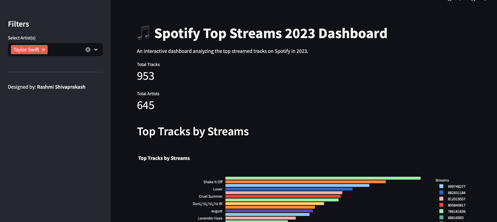

# Spotify Top Streams 2023 Dashboard

## Overview
The Spotify Top Streams 2023 Dashboard is an interactive web application built with Python using Streamlit. It analyzes and visualizes the top streamed tracks on Spotify for the year 2023. The dashboard provides insights into the most popular tracks and artists, along with detailed analysis based on streams, danceability, energy levels, and other musical attributes.

Dashboard URL: [Live Dashboard](https://spotify-top-streamed-2023.streamlit.app)

## Features
- **Interactive Filters**: Users can filter data based on artist names to customize the view.
- **Top Tracks by Streams**: Visualizes the most streamed tracks on Spotify.
- **Number of Top Tracks per Artist**: Shows which artists have the most top-streamed tracks.
- **Danceability vs Energy**: Compares tracks based on their danceability and energy attributes.
- **Correlation Heatmap**: Analyzes the correlation between different musical attributes.
